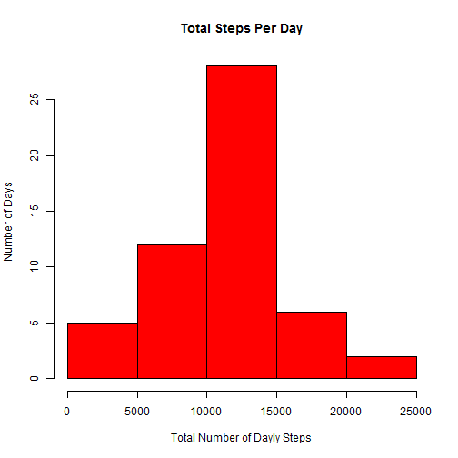
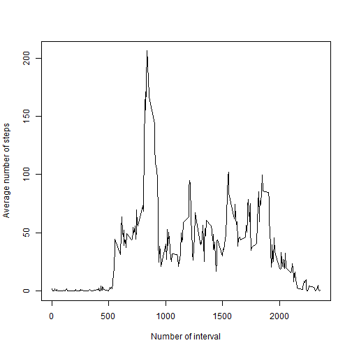
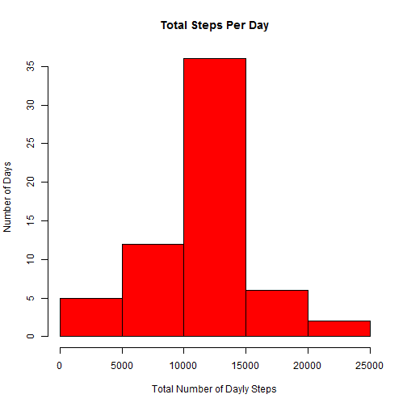

## Loading and preprocessing the data

The original data is loaded as follows:

```r
url <- "http://d396qusza40orc.cloudfront.net/repdata%2Fdata%2Factivity.zip"
download.file(url, destfile = "repdata-data-activity.zip", mode="wb")
raw_data <- read.csv(unzip("repdata-data-activity.zip"), header = TRUE)
```

Let's have a look at this data


```r
head(raw_data)
```

```
##   steps       date interval
## 1    NA 2012-10-01        0
## 2    NA 2012-10-01        5
## 3    NA 2012-10-01       10
## 4    NA 2012-10-01       15
## 5    NA 2012-10-01       20
## 6    NA 2012-10-01       25
```

```r
dim(raw_data)
```

```
## [1] 17568     3
```


## What is mean total number of steps taken per day?

First of all, let's take only non-missing values into account and subset a corresponding dataset from the original data


```r
subdata <- raw_data[complete.cases(raw_data), ]
```

Let's see inside of this subset


```r
head(subdata)
```

```
##     steps       date interval
## 289     0 2012-10-02        0
## 290     0 2012-10-02        5
## 291     0 2012-10-02       10
## 292     0 2012-10-02       15
## 293     0 2012-10-02       20
## 294     0 2012-10-02       25
```

```r
dim(subdata)
```

```
## [1] 15264     3
```


Now we make a histogram of the total number of steps taken each day


```r
totals_days <- aggregate(steps ~ date, subdata, sum)

hist(totals_days$steps,  col = "red", main = "Total Steps Per Day", 
     xlab = "Total Number of Dayly Steps", ylab = "Number of Days")
```

 

Calculate and report the mean and median total number of steps taken per day


```r
mean(totals_days$steps)
```

```
## [1] 10766.19
```

```r
median(totals_days$steps)
```

```
## [1] 10765
```

## What is the average daily activity pattern?

Make a time series plot (i.e. type = "l") of the 5-minute interval (x-axis) and the average number of steps taken, averaged across all days (y-axis)


```r
totals_intervals <- aggregate(steps ~ interval, subdata, mean)
plot(totals_intervals$interval, totals_intervals$steps, type="l",
     xlab="Number of interval", ylab = "Average number of steps")
```

 

Which 5-minute interval, on average across all the days in the dataset, contains the maximum number of steps?


```r
totals_intervals$interval[which.max(totals_intervals$steps)]
```

```
## [1] 835
```

```r
max(totals_intervals$steps)
```

```
## [1] 206.1698
```

## Imputing missing values

Calculate and report the total number of missing values in the dataset (i.e. the total number of rows with NAs)


```r
sum(!complete.cases(raw_data))
```

```
## [1] 2304
```

Fill in all of the missing values in the dataset using the mean for 5-minute intervals (calculated above).


```r
fill_steps <- numeric()
for (i in 1:nrow(raw_data)) {
       observation <- raw_data[i, ]
       if (is.na(observation$steps)) {
             steps <- totals_intervals[totals_intervals$interval == 
                                         observation$interval,]$steps
         } else {
               steps <- observation$steps
           }
       fill_steps <- c(fill_steps, steps)
   }
```

Create a new dataset that is equal to the original dataset but with the missing data filled in.


```r
processed_data <- raw_data
processed_data$steps <- fill_steps
```

Make a histogram of the total number of steps taken each day.


```r
totals_days_new <- aggregate(steps ~ date, processed_data, sum)
hist(totals_days_new$steps,  col = "red", main = "Total Steps Per Day", 
     xlab = "Total Number of Dayly Steps", ylab = "Number of Days")
```

 

Calculate and report the mean and median total number of steps taken per day


```r
mean(totals_days_new$steps)
```

```
## [1] 10766.19
```

```r
median(totals_days_new$steps)
```

```
## [1] 10766.19
```

As we can see, the median total number of dayly steps has changed and has become equal to
the mean.

## Are there differences in activity patterns between weekdays and weekends?

Create a new factor variable in the dataset with two levels -- "weekday" and "weekend" indicating whether a given date is a weekday or weekend day.


```r
Sys.setlocale("LC_TIME", "English")
```

```
## [1] "English_United States.1252"
```

```r
Sys.setenv(TZ = "UTC")
processed_data$date <- strptime(processed_data$date,
               "%Y-%m-%d", tz = "EST5EDT")
processed_data$day <- ifelse(weekdays(processed_data$date) 
                             %in% c("Saturday", "Sunday"),'weekend','weekday')
```

Look at the new processed_data


```r
head(processed_data)
```

```
##       steps       date interval     day
## 1 1.7169811 2012-10-01        0 weekday
## 2 0.3396226 2012-10-01        5 weekday
## 3 0.1320755 2012-10-01       10 weekday
## 4 0.1509434 2012-10-01       15 weekday
## 5 0.0754717 2012-10-01       20 weekday
## 6 2.0943396 2012-10-01       25 weekday
```

Make a panel plot containing a time series plot (i.e. type = "l") of the 5-minute interval (x-axis) and the average number of steps taken, averaged across all weekday days or weekend days (y-axis). 


```r
totals_intervals_dayweeks <- aggregate(steps ~ interval + day,processed_data, mean)

library(lattice)
xyplot(steps ~ interval | day, totals_intervals_dayweeks, type = "l", layout = c(1, 2), 
       xlab = "Interval", ylab = "Number of steps")
```

 

As we can see from above plot there is a definite difference between activity patterns for
weekdays and weekends.
